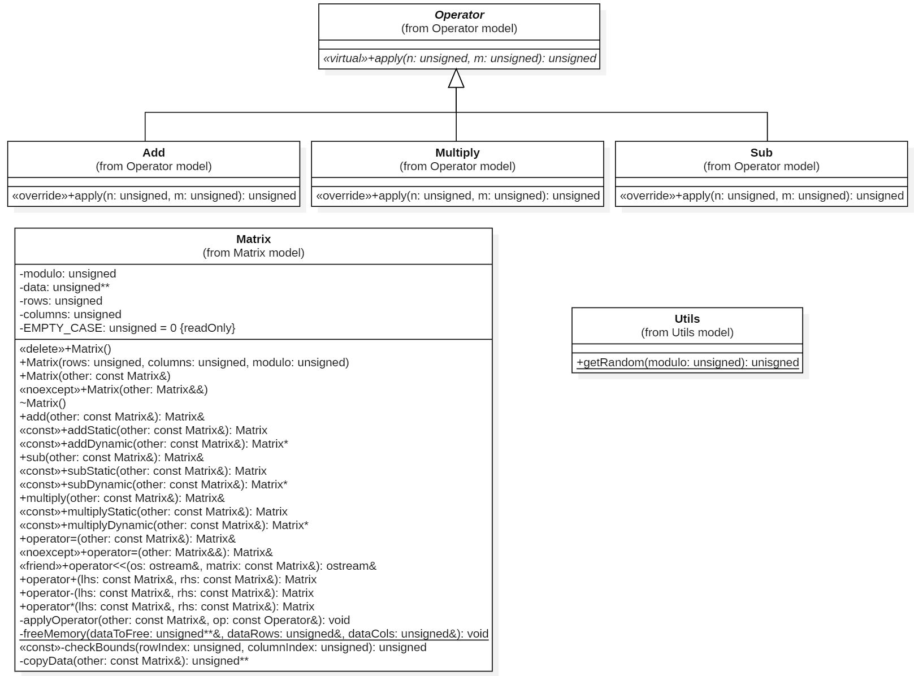

# POA Labo 1 - Matrix reloaded

**Auteurs:** Walid Slimani et Timothée Van Hove

**Date:** 18.03.2024

## Introduction

Le but de ce laboratoire est d'implémenter une classe permettant de représenter des matrices de taille quelconque (`N`x`M`) contenant des éléments entre `0` et `n − 1` pour un entier `n` strictement positif (les entiers sont "modulo" n) qui réponde aux contraintes ci-dessous:

- Une matrice peut être crée en générant son contenu aléatoirement (une fois sa taille et son modulo connus).
- Les valeurs de la matrice sont stockées dans un tableau à 2 dimensions.
- Le contenu de la matrice peut être affiché en utilisant l’opérateur de flux `<<`.
- Un matrice peut être dupliquée (par construction et par assignement).
- Une matrice peut être déplacée (par construction et par assignement).
- Implémenter les opérations suivantes modulo n:
  - l’addition
  - la soustraction
  - le produit composante par composante


## Compilateur et options de compilation

**Compilateur :** `g++ version 12.2.0`

**Version c++ :** `17`

**Build systems :** `cmake 3.23.2` et  `ninja 1.10.1`

**Options de compilation :** `-Wall -Wextra -Wpedantic -Wconversion -Wsign-conversion -Wvla -Werror`

### Compiler et lancer le programme

note: ninja et cmake doivent être installés sur votre machine 

#### Windows

```powershell
# Depuis la racine du projet
New-Item -Path build -ItemType Directory -Force; cd build; cmake .. -G "Ninja"; ninja; .\matrix.exe <N1> <M1> <N2> <M2> <mod>
```

#### Linux

````bash
# Depuis la racine du projet
mkdir -p build && cd build && cmake .. -G "Ninja" && ninja && ./matrix <N1> <M1> <N2> <M2> <mod>
````


## UML




## Choix d'implémentation

Pour ce laboratoire, nous avons choisi d'interdire la création de matrices ayant 0 ligne ou 0 colonne. Si l'utilisateur décide de créer une telle matrice, une exception de type `runtime_error` sera levée.

Nous avons aussi décidé de ne pas autoriser la création d'une matrice en utilisant le constructeur vide par défaut, car ce dernier n'est pas requis ni dans la donnée ni dans notre utilisation de cette classe.

### Représentation des éléments

Étant donné qu'une matrice ne peut contenir que des nombres entiers naturels positifs, nous avons choisi d'implémenter un tableau à 2 dimensions de type `unsigned int`. Le nombre de lignes, colonnes et le modulo sont aussi de de type `unsigned int`.

### Opérations

Pour utiliser facilement les opérations, nous avons créé une interface `Operation` contenant une méthode abstraite `apply`, qui est implémentée par les classes `Add`, `Sub` et `Multiply`. Cette implémentation est responsable de l'addition, soustraction et multiplication de chaque élément i, j de la matrice. Exemple de l'implémentation de `apply` pour l'addition:

```c++
unsigned Add::apply(unsigned n, unsigned m) const
   return n + m;
}
```

Il est alors très simple d'appliquer les opérations sur les éléments i, j d'une matrice, sans devoir créer une méthode dédiée à chaque opération.

### Gestion des underflow

Lors d'une soustraction de matrice par une autre, et parce que nous utilisons des entiers non signés, il est possible de créer un underflow si le membre de droite est plus grand que le membre de gauche. Pour éviter ce genre de problème, nous avons choisi de systématiquement ajouter au membre de gauche la valeur du modulo. Cette modification n'a aucune incidence sur les opérations d'addition et de multiplication. Démonstration :

$$
\begin{align*}
&\quad \text{Puisque } m \equiv m + kp \mod p \text{ pour tout entier } k, \text{ en choisissant } k = 1, \text{ nous avons :}\\
&\quad m \equiv m + p \mod p\\
&\quad \text{Donc, } m - n \mod p = (m + p) - n \mod p\\
\\
&\quad \text{En utilisant le même principe, } m \equiv m + p \mod p\\
&\quad \text{Donc, } m + n \equiv (m + p) + n \mod p \text{ et ainsi :}\\
&\quad m + n \mod p = (m + p) + n \mod p\\
\\
&\quad \text{La multiplication par } n \text{ est distributive sur l'addition modulo } p, \text{ donc :}\\
&\quad (m + kp) \times n \equiv m \times n + k \times p \times n \mod p\\
&\quad \text{En choisissant } k = 1, \text{ cela nous donne :}\\
&\quad (m + p) \times n \equiv m \times n + p \times n \mod p\\
&\quad \text{Puisque } p \times n \text{ est un multiple de } p, \text{ il est congruent à } 0 \mod p, \text{ donc :}\\
&\quad (m + p) \times n \equiv m \times n \mod p
\end{align*}
$$

Cela est équivalent à utiliser une opération `floorMod` avec des entiers signés.

### Avantages et inconvénients des 3 types d'opérations

Il est demandé dans la donnée d'implémenter les 3 opérations `+`, `-` et `*` sous trois formes distinctes:

- En modifiant la matrice sur laquelle est invoquée la méthode
- En retournant, par valeur (pourquoi par valeur et non par référence?) une nouvelle matrice résultat alloué statiquement.
- En retournant, un pointeur sur une nouvelle matrice résultante allouée dynamiquement.

#### Opération en place

Les avantages de cette méthode sont qu'aucune nouvelle matrice n'est créée, ce qui économise de la mémoire. De plus la matrice originale est directement mise à jour, ce qui peut être intuitif dans certains contextes où on souhaite conserver les modifications.

Les inconvénients sont que l'état initial est perdu après l'opération. Cela peut être problématique si l'état original est nécessaire ultérieurement. De plus, puisque la matrice originale est modifiée, il est difficile de chaîner les opérations sans altérer le résultat des opérations précédentes.

#### Retourner la valeur d'une nouvelle matrice

Il est nécessaire de retourner la matrice résultat (allouée statiquement) par valeur, le cas échéant la référence ou le pointeur retourné pointerait sur un élément désalloué en retour de fonction, car un objet alloué statiquement dans une fonction est automatiquement détruit lors de la sortie du scope.

Les avantages de cette méthode sont que la matrice originale reste inchangée (immuable), ce qui est souvent apprécié pour sa prévisibilité et sa sécurité. De plus, chaque opération retourne un nouveau résultat sans modifier les opérandes, il est donc simple de chaîner plusieurs opérations.

Par contre, créer une nouvelle matrice à chaque opération peut être coûteux en termes de performance, surtout pour de grandes matrices.

#### Retourner un pointeur

Les avantages de cette méthode sont qu'elle nous permet de choisir quand et comment nous voulons gérer la mémoire, ce qui peut être utile dans des contextes où la gestion fine de la mémoire est nécessaire.

Cela implique malheureusement de placer la responsabilité de la destruction de l'objet au code appelant, ce qui peut être la source de memory leaks si la désallocation n'est pas bien gérée.


## Tests

### Tests unitaires

Pour assurer la fiabilité de notre implémentation, nous avons développé une suite de tests unitaires en utilisant le framework Google Test. Ces tests, situés dans le fichier `test/MatrixTest.cpp`, permettent de vérifier le bon fonctionnement des différentes méthodes de notre classe `Matrix`, y compris les trois types d'opérations fondamentales : addition, soustraction et multiplication.

Étant donné que les membres de données de notre classe `Matrix` sont privés, et afin de préserver l'encapsulation, nous avons implémenté la fonction `getInnerData`, qui reconstruit un vecteur 2D à partir du flux de sortie généré par la surcharge de l'opérateur `<<`. Cette approche nous permet d'inspecter le contenu interne de nos matrices sans compromettre leur intégrité ou leur encapsulation.

````c++
using Vector2D = std::vector<std::vector<unsigned>>;
Vector2D getInnerData(const Matrix &matrix, unsigned rows, unsigned cols) {
    std::stringstream s;
    s << matrix;
	
    // Create the 2d vector
    std::vector<std::vector<unsigned>> data(rows, std::vector<unsigned>(cols));

    std::string line;
    
    // Parse each element and populate the vector
    for (unsigned i = 0; i < rows && std::getline(s, line); ++i) {
        std::istringstream lineStream(line);
        for (unsigned j = 0; j < cols; ++j) {
            lineStream >> data[i][j];
        }
    }
    return data;
}
````


### Compiler et lancer les tests

#### Windows

````powershell
# Depuis la racine du projet
New-Item -Path build -ItemType Directory -Force; cd build; cmake .. -G "Ninja"; ninja; .\tests.exe
````

#### Linux

````bash
# Depuis la racine du projet
mkdir -p build && cd build && cmake .. -G "Ninja" && ninja && ./tests
````


### Tests manuels

Nous avons manuellement testé la sortie sur la console de l'opérateur de flux `<<` ainsi que la sortie sur console du programme demandé dans `main.cpp`.


### Récapitulatif des tests unitaires

| #    | Description                                                  | ok/nok |
| ---- | ------------------------------------------------------------ | ------ |
| 1    | Le constructeur par valeurs génère une matrice avec le bon nombre de lignes et de colonnes | ok     |
| 2    | Une matrice 1xN est possible                                 | ok     |
| 3    | Une matrice Nx1 est possible                                 | ok     |
| 4    | Le constructeur par valeurs doit lancer une exception si le modulo est 0 | ok     |
| 5    | Le constructeur par valeurs doit lancer une exception si le nombre de lignes est 0 | ok     |
| 6    | Le constructeur par valeurs doit lancer une exception si le nombre de colonnes est 0 | ok     |
| 7    | Il doit être possible de construire une matrice 1x1          | ok     |
| 8    | Il doit être possible de construire une matrice avec un modulo de 1 | ok     |
| 9    | Utiliser le constructeur de copie, les 2 matrices doivent avoir les mêmes valeurs | ok     |
| 10   | Utiliser le constructeur de déplacement, les 2 matrices doivent avoir les mêmes valeurs | ok     |
| 11   | Le destructeur doit supprimer correctement l'objet           | ok     |
| 12   | L'addition avec des modulos différents doit lancer une exception | ok     |
| 13   | L'addition avec le même modulo doit être valide et retourner la bonne somme | ok     |
| 14   | L'addition en chaîne doit être possible et retourner la bonne somme | ok     |
| 15   | Une matrice doit pouvoir s'additionner à elle-même           | ok     |
| 16   | La soustraction avec des modulos différents doit lancer une exception | ok     |
| 17   | La soustraction avec le même modulo doit être valide et retourner la bonne différence | ok     |
| 18   | Une matrice doit pouvoir se soustraire à elle-même et la différence est 0 pour chaque élément | ok     |
| 19   | La multiplication avec des modulos différents doit lancer une exception | ok     |
| 20   | La multiplication avec le même modulo doit être valide et retourner le bon produit | ok     |
| 21   | Une matrice doit pouvoir se multiplier par elle-même et le produit doit être correcte | ok     |
| 22   | L'affectation doit résulter dans les mêmes données mais des adresses différentes | ok     |
| 23   | L'affectation de déplacement doit résulter dans les mêmes données de l'objet | ok     |
| 24   | L'auto-affectation doit être possible                        | ok     |
| 25   | L'auto-affectation doit résulter dans la même adresse d'objet | ok     |
| 26   | L'addition en place doit être valide                         | ok     |
| 27   | La soustraction en place doit être valide                    | ok     |
| 28   | La multiplication en place doit être valide                  | ok     |
| 29   | L'addition dynamique doit être valide                        | ok     |
| 30   | La soustraction dynamique doit être valide                   | ok     |
| 31   | La multiplication dynamique doit être valide                 | ok     |


## Conclusion

Ce laboratoire nous a donné l'opportunité de concevoir et d'implémenter une classe pour manipuler des matrices en C++. Il nous a également permis de consolider nos connaissances en programmation orientée objet et en C++.

En prenant des décisions de conception réfléchies, nous avons réussi à répondre aux contraintes spécifiques de l'énoncé tout en explorant différentes approches pour chaque opération. Cela nous a notamment permis d'approfondir notre compréhension des mécanismes de création et de destruction d'objets.

Les tests unitaires ont joué un rôle crucial dans la validation de notre code, garantissant son bon fonctionnement dans une variété de scénarios.

En conclusion, ce laboratoire nous a permit de développer un programme permettant d'effectuer diverses opérations sur des matrices dans le but d'enrichir notre apprentissage du langage C++ et du paradigme de l'orienté objet.
